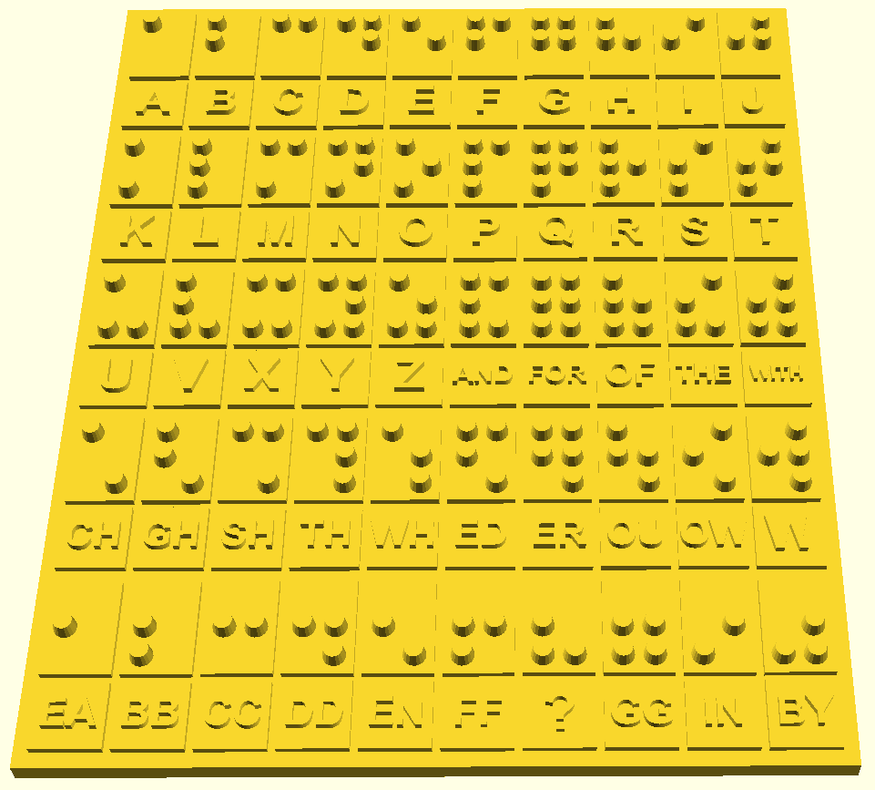
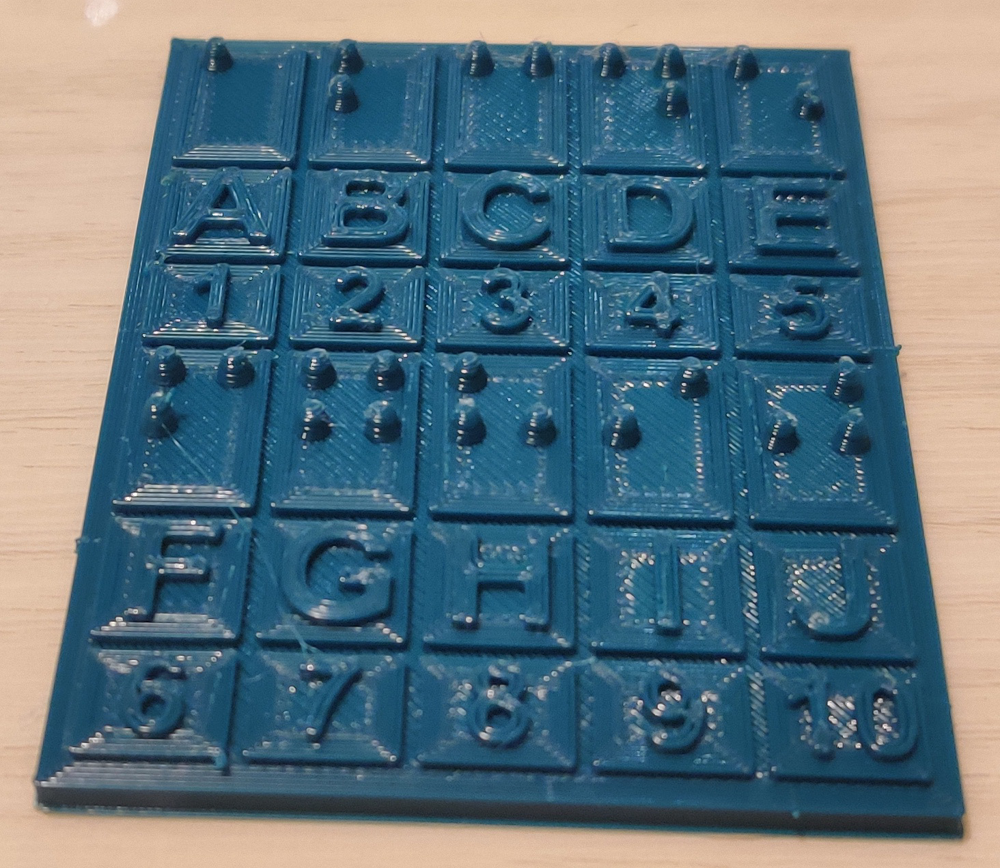

# demo_braille
Text to English Braille translation module using python.  
The method of Braille translation can be varied to correspond to various chapters in the Standard English Braille pdf in the docs to allow users of different stages of Braille learning progress to create translations at their level.  
This module is a demo subproject of an engineering system that is used to convert text to English Braille as a 3D object and then prepare it and print it on a 3D printer farm.  

# Installation
NOTE: ALL INSTRUCTIONS ARE FOR LINUX.  
## 0. Prerequisites  
- Python 3  

## 1. Open the project in a new terminal window
1.1. Open a new terminal window  
1.2. Navigate to the project with the following command  
- cd path/to/project/main/directory  

## 2. Create virtual environment
2.1. Terminal command  
- python3 -m venv env_demo_braille  

## 3. Enter virtual environment
3.1. Terminal command  
- source env_demo_braille/bin/activate  

## 4. Install required python packages
4.1. Terminal command  
- pip3 install -r requirements.txt  

## 11. Run project
11.1. Run interactive translator tool with terminal command  
- python3 main.py

11.2. Run tests
- python3 tests/all_tests.py

# Gallery
3D render of Braille object  

  
3D printed Braille object  

# License
This project is licensed under the GNU General Public License v3.0 - see the [LICENSE](LICENSE) file for details